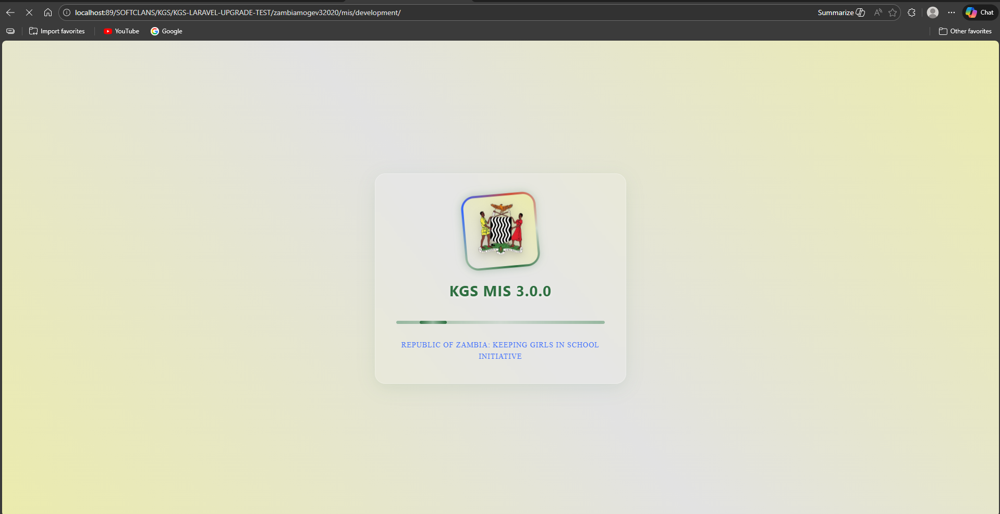
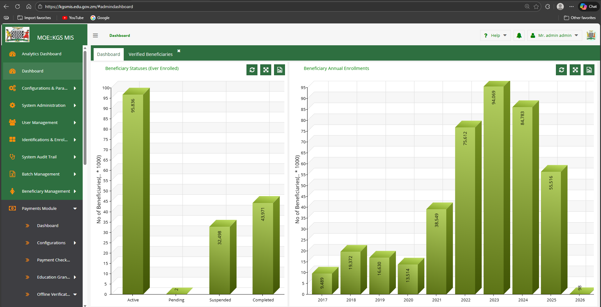

# KGS MIS (Management Information System)

A comprehensive Management Information System built with Laravel (backend) and ExtJS (frontend).

## Overview

KGS MIS is a production Management Information System designed for managing beneficiaries, payments, assets, financial transactions, and various administrative operations.

## Screenshots

## Modules

The system includes the following modules:

| Module | Description |
|--------|-------------|
| **Administration** | System administration and user role management |
| **AssetRegister** | Fixed assets tracking and management |
| **AuditTrail** | System activity logging and audit tracking |
| **BenBatchManagement** | Beneficiary batch processing and management |
| **CaseManagement** | Case handling and workflow management |
| **Configurations** | System-wide configuration settings |
| **Dashboards** | Data visualization and reporting dashboards |
| **Dms** | Document Management System |
| **FinancialModule** | Financial transactions and accounting |
| **FrontOffice** | Front desk operations and visitor management |
| **GrmModule** | Grievance Redress Mechanism |
| **IdentificationEnrollment** | Beneficiary identification and enrollment |
| **MandEModule** | Monitoring and Evaluation |
| **Mobile** | Mobile interface and synchronization |
| **Parameters** | System parameters and settings |
| **PaymentModule** | Payment processing and tracking |
| **ReportsModule** | Report generation and exports |
| **SchoolManagement** | Educational institution management |
| **StatusesManagement** | Application status tracking |
| **SystemIntegrations** | External system integrations |
| **UserManagement** | User accounts and authentication |

## Technology Stack

- **Backend**: Laravel PHP Framework
- **Frontend**: ExtJS (Classic & Modern Toolkits)
- **Database**: MySQL
- **Build Tool**: Sencha Cmd

